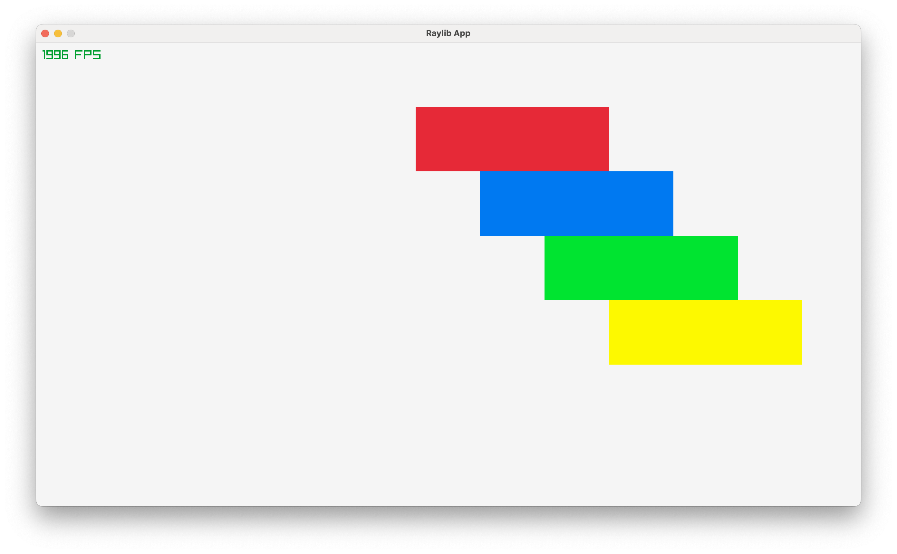

# Solid Raylib

This project demonstrates a custom renderer for SolidJS that integrates with the Raylib graphics library. It is mainly meant for making game GUIs.

Very work in progress.



App.js

```jsx
import { createSignal } from "solid-js";
import { onFrame } from "./ray.js";

export default function App() {
  const [count, setCount] = createSignal(0);

  onFrame((delta) => {
    setCount(count() + delta);
  });

  return (
    <window width={1280} height={720} title="Raylib App">
      <fps x={10} y={10} />
      <rectangle x={() => 490 - 100 * Math.cos(count())} y={100} width={300} height={100} color="red"></rectangle>
      <rectangle x={() => 490 - 200 * Math.cos(count())} y={200} width={300} height={100} color="blue"></rectangle>
      <rectangle x={() => 490 - 300 * Math.cos(count())} y={300} width={300} height={100} color="green"></rectangle>
      <rectangle x={() => 490 - 400 * Math.cos(count())} y={400} width={300} height={100} color="yellow"></rectangle>
    </window>
  );
}
```

## References

https://youtu.be/Yi_MJ8cVCCs

https://github.com/whoisryosuke/solid-three-renderer
