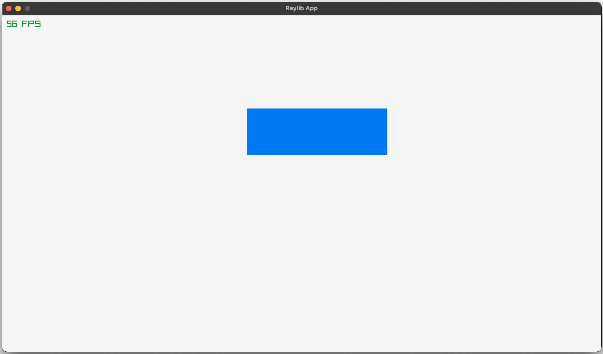

# Solid Raylib - Monorepo

This project demonstrates a custom renderer for SolidJS that integrates with the Raylib graphics library.<br/>
It is being built as an experimental GUI solution for [Doomhowl Interactive](https://doomhowl-interactive.com).

Very work in progress.

> Reactive text nodes are not supported yet. So you can only use a minimal set of SolidJS features.
> You will need to use the recreated SolidJS components for doing things like conditionals and loops.

## Project Structure

This is a monorepo containing:

- `packages/solid-raylib` - The core renderer library
- `packages/solid-raylib-demo` - A demo application showcasing the renderer

## Getting Started

### Install Dependencies

```bash
npm install
```

### Build the Core Library

```bash
npm run build:core
```

### Run the Demo

```bash
npm run start:demo
```

## Example Code

```jsx
import { createSignal, createEffect, onCleanup } from "solid-raylib";

export default function App() {
  const [count, setCount] = createSignal(0);

  createEffect(() => {
    const timer = setInterval(() => {
      setCount((c) => c + 0.01);
    }, 10);

    onCleanup(() => {
      clearInterval(timer);
    });
  });

  return (
    <window width={1280} height={720} title="Raylib App">
      <fps x={10} y={10} />
      <rectangle x={count() * 100} y={200} width={300} height={100} color="blue"></rectangle>
    </window>
  );
}
```



_The rectangle moves across the screen!_

## Continuous Integration

This project uses GitHub Actions for continuous integration and deployment:

- **CI Workflow**: Builds the project on every push to main and pull request
- **Publish Workflow**: Publishes the package to npm when a new version tag is pushed

To create a new release:

```bash
# Update version in package.json files
git tag v0.1.x
git push origin v0.1.x
```

## References

https://youtu.be/Yi_MJ8cVCCs

https://github.com/RobLoach/node-raylib

https://github.com/whoisryosuke/solid-three-renderer

https://www.thisdot.co/blog/deep-dive-into-how-signals-work-in-solidjs

https://www.thisdot.co/blog/how-to-create-your-own-custom-renderer-in-solidjs
